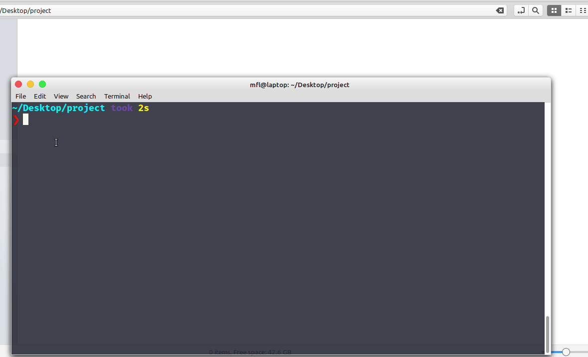

# :rocket: Shell Script para gerar estrutura de diretórios

Script básico para gerar estrutura de diretórios seguindo a metodologia DDD nos padrões do treinamento GoStack da Rocketseat.

Como o processo é bastante repetitivo, nada melhor que automatizar a tarefa 😍



## Gerando o diretório src ni início do projeto

Para gerar o diretório src no início do projeto já com alguns padrões de estrutura vista no treinamento, basta rodar o script dentro da raíz do projeto:

```bash
$ chmod 750 generate.sh
$ ./generate.sh
```

Escolha a opção 1 e a estrutura será gerada.

## Gerando um módulo específico dentro do diretórios modules

Para gerar um novo módulo já com alguns padrões de estrutura vista no treinamento, basta rodar o script dentro da raíz do projeto:

```bash
$ chmod 750 generate.sh
$ ./generate.sh
```

Escolha a opção 2, digite o nome do módulo e a estrutura será gerada.

Gostou da ideia? O que pode ser melhorado? Fique à vontade para colaborar.

---

Made with ♥ by Márcio França Lima. [Contact me](https://www.linkedin.com/in/m%C3%A1rcio-fran%C3%A7a-lima-916454187/)